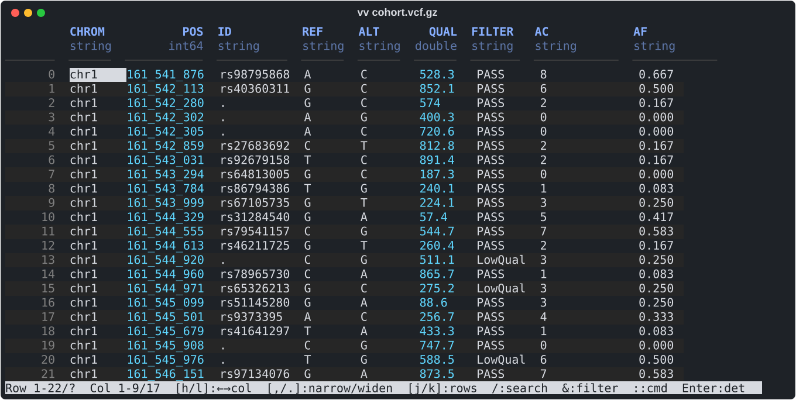
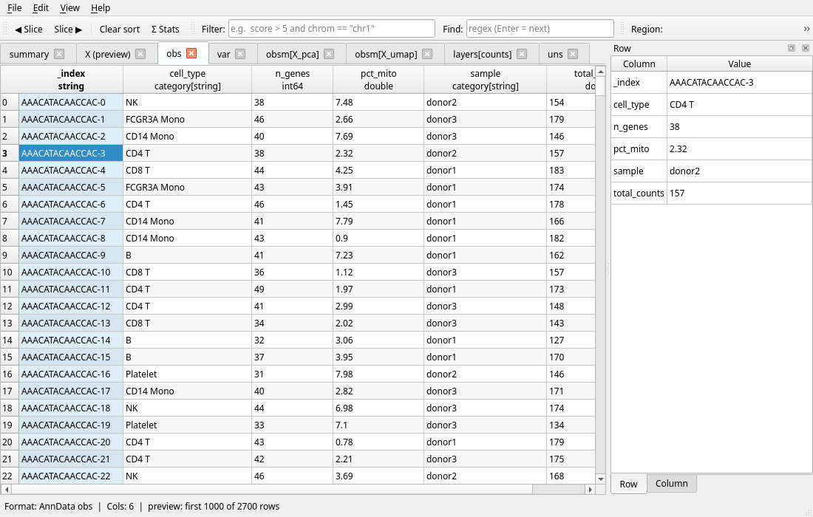

# vv — universal genomic file viewer

[](https://github.com/balwierz/vv/actions/workflows/ci.yml)
[](LICENSE)
[](https://github.com/balwierz/vv/releases)

**One command that opens every genomic and tabular file you have, and shows you the data.**

`vv file` — VCF, BAM, AnnData, Parquet, BED, FASTQ, JSON, Excel, SQLite and
[30-odd more](#formats), plain or compressed. On a terminal it opens an
interactive viewer; in a pipe it prints text, TSV, JSON or Parquet. `vvg` is the
same reader in a desktop window. One static binary, no environment to activate.





More screenshots, one per format: **[docs/formats.md](docs/formats.md)**.

## Highlights

- **Any format, one command** — dispatched by extension or content; gzip, bgzip, zstd, bzip2 and xz on the fly; stdin and pipes.
- **Terminal viewer** — scroll, search (`/`), filter (`&`), sort (`s`), column stats (`S`), record detail (`Enter`), tabs; a folding tree for JSON.
- **Desktop viewer** — [vvg](docs/vvg.md): the same views in a Qt6 window, Dolphin thumbnails on KDE.
- **Region queries** — `-r chr1:1000-2000` on indexed BAM / CRAM / VCF / BCF / BED / GFF / bigWig, and Parquet with chrom / start / end columns.
- **Filter, select, sort** — `--filter 'QUAL > 30 and FILTER == "PASS"'`, `--select 'chr*,@numeric'`, `--sort POS:desc`.
- **Convert** — `--tsv`, `--csv`, `--json`, `--ndjson`, `--md`, `--parquet out.parquet`, `--arrow out.arrow`.
- **Large files** — reads only what the screen needs, so big Parquet, BAM and JSON files open without a full scan.
- **Summaries** — `--schema`, `--describe`, `--seq-stats`, `--gt-stats`, `--contigs`, `--unique`.

## Formats

| Format | Extensions | |
|---|---|---|
| VCF / BCF | `.vcf` `.vcf.gz` `.bcf` | [screens](docs/formats.md#vcf--bcf) |
| BAM / CRAM / SAM, PAF | `.bam` `.cram` `.sam` `.paf` | [screens](docs/formats.md#bam--cram--sam--paf) |
| BED, ENCODE peaks, bedGraph | `.bed` `.narrowPeak` `.broadPeak` `.gappedPeak` `.bedGraph` `.bg` `.tagAlign` | [screens](docs/formats.md#bed-and-encode-peaks) |
| GFF / GTF | `.gff` `.gff3` `.gtf` | [screens](docs/formats.md#gff--gtf) |
| FASTA / FASTQ | `.fa` `.fasta` `.fna` `.faa` `.ffn` `.frn` `.fq` `.fastq` | [screens](docs/formats.md#fasta--fastq) |
| bigWig / bigBed / 2bit, wiggle | `.bw` `.bigWig` `.bb` `.bigBed` `.2bit` `.wig` | [screens](docs/formats.md#bigwig--bigbed--2bit--wig) |
| samtools mpileup | `.pileup` `.mpileup` `.pile` | [notes](docs/formats.md#mpileup) |
| BLAST / DIAMOND tabular | `.m8` `.blast6` `.outfmt6` | [notes](docs/formats.md#blast--diamond-tabular) |
| PLINK, BEDPE, pairs, GCT, MAF | `.bim` `.fam` `.pvar` `.psam` `.bedpe` `.pairs` `.gct` `.maf` | [notes](docs/formats.md#plink-and-tsv-layouts) |
| AnnData / MuData / HDF5 / Loom / 10x, FAST5, NetCDF-4 | `.h5ad` `.h5mu` `.h5` `.hdf5` `.loom` `.h5seurat` `.fast5` `.nc` `.nc4` | [screens](docs/formats.md#anndata--hdf5--loom--10x) |
| MatrixMarket | `.mtx` | [screens](docs/formats.md#matrixmarket) |
| NumPy | `.npz` `.npy` |
| R data | `.rds` `.RData` `.rda` | [notes](docs/formats.md#r-data) | [screens](docs/formats.md#numpy) |
| Parquet, LociSSD | `.parquet` `.lociss` | [screens](docs/formats.md#parquet--arrow--orc) |
| Arrow IPC / Feather, ORC | `.arrow` `.arrows` `.feather` `.orc` | [screens](docs/formats.md#parquet--arrow--orc) |
| TSV / CSV | `.tsv` `.csv` | [screens](docs/formats.md#tsv--csv) |
| Excel / OpenDocument | `.xlsx` `.xlsm` `.ods` `.fods` | [screens](docs/formats.md#excel--ods--sqlite) |
| SQLite | `.sqlite` `.sqlite3` `.db` | [screens](docs/formats.md#excel--ods--sqlite) |
| JSON / NDJSON, GeoJSON, notebooks, HAR | `.json` `.ndjson` `.jsonl` `.geojson` `.ipynb` `.har` | [screens](docs/formats.md#json--ndjson) |
| Markdown | `.md` `.markdown` `.mdown` `.mkd` | [screens](docs/formats.md#markdown) |
| Plain text, logs | `.txt` `.text` `.log`, any other text file | [screens](docs/formats.md#plain-text-and-logs) |
| Directories, Hive datasets | `vv dir/` | [screens](docs/formats.md#directories-and-datasets) |

Text formats also read as `.gz` / `.bgz` / `.zst` / `.bz2` / `.xz`; `vv --formats` prints the
full capability table.

## Install

Linux and macOS packages for x86_64 and aarch64 are on the
[releases page](https://github.com/balwierz/vv/releases/latest) (with `SHA256SUMS`):

```sh
# Debian / Ubuntu (arm64: replace amd64; vv-gui_*.deb adds vvg)
curl -LO https://github.com/balwierz/vv/releases/download/v1.26.1/vv_1.26.1-1_amd64.deb
sudo apt install ./vv_1.26.1-1_amd64.deb

# Fedora (vv-gui-*.rpm adds vvg)
sudo dnf install ./vv-*.rpm

# Any Linux, glibc ≥ 2.28: static binary
curl -L https://github.com/balwierz/vv/releases/download/v1.26.1/vv-1.26.1-linux-x86_64.tar.gz | tar -xz
sudo install vv-1.26.1-linux-x86_64/vv /usr/local/bin/

# Arch Linux (vv + vv-gui)
git clone https://github.com/balwierz/vv.git && cd vv/packaging/arch && makepkg -si
```

macOS tarball, building from source and the GUI build: [INSTALL.md](INSTALL.md).

## Quick start

```sh
vv calls.vcf.gz                                   # interactive viewer (q quits, H help)
vv -n 20 peaks.parquet                            # first 20 rows as a table
vv -r chr17:43044295-43125483 reads.bam           # region query
vv --tab obs --filter 'cell_type == "B"' pbmc.h5ad
vv --filter 'MAPQ >= 30' --select QNAME,POS,MAPQ --tsv reads.bam > hits.tsv
vv --parquet out.parquet table.csv.gz             # convert
vv --describe data.parquet                        # per-column statistics
zcat big.tsv.gz | vv -                            # from a pipe
```

## Documentation

- [Formats gallery](docs/formats.md) — what each format looks like in vv and vvg
- [User manual](docs/USAGE.md) — every mode and flag with examples (`man vv` once installed)
- [vvg](docs/vvg.md) — the desktop viewer and the KDE integration
- [INSTALL.md](INSTALL.md) · [CHANGELOG.md](CHANGELOG.md) · [CONTRIBUTING.md](CONTRIBUTING.md)

## Citation, license

Cite via [`CITATION.cff`](CITATION.cff) ("Cite this repository" on GitHub).
MIT licensed ([LICENSE](LICENSE)); links Apache Arrow (Apache 2.0), htslib,
ncurses, mimalloc (MIT) and compression libraries. Bug reports and pull requests
are welcome — see [CONTRIBUTING.md](CONTRIBUTING.md), the
[Code of Conduct](CODE_OF_CONDUCT.md) and [SECURITY.md](SECURITY.md).
