# What vv shows for each format

Screenshots of `vv` (terminal) and `vvg` (desktop) on realistic synthetic data,
one section per format family. Every image is regenerated by
[`docs/shots/make_shots.sh`](shots/make_shots.sh), so it shows what the current
build prints. Flags and options are covered in the [manual](USAGE.md).

**Genomics** —
[VCF / BCF](#vcf--bcf) ·
[BAM / CRAM / SAM / PAF](#bam--cram--sam--paf) ·
[BED and ENCODE peaks](#bed-and-encode-peaks) ·
[GFF / GTF](#gff--gtf) ·
[FASTA / FASTQ](#fasta--fastq) ·
[bigWig / bigBed / 2bit / WIG](#bigwig--bigbed--2bit--wig) ·
[mpileup](#mpileup) ·
[BLAST / DIAMOND tabular](#blast--diamond-tabular) ·
[PLINK and TSV layouts](#plink-and-tsv-layouts) 
**Single cell and matrices** —
[AnnData / HDF5 / Loom / 10x](#anndata--hdf5--loom--10x) ·
[Zarr](#zarr) ·
[MatrixMarket](#matrixmarket) ·
[NumPy](#numpy) ·
[R data](#r-data) ·
[Cooler Hi-C](#cooler-hi-c) ·
[GenBank / EMBL](#genbank--embl) ·
[Nanopore POD5](#nanopore-pod5) 
**Tables** —
[Parquet / Arrow / ORC](#parquet--arrow--orc) ·
[TSV / CSV](#tsv--csv) ·
[Excel / ODS / SQLite](#excel--ods--sqlite) ·
[Directories and datasets](#directories-and-datasets) 
**Documents** —
[JSON / NDJSON](#json--ndjson) ·
[Markdown](#markdown) ·
[Plain text and logs](#plain-text-and-logs) ·
[Stdin](#stdin)

---

## VCF / BCF

`.vcf` `.vcf.gz` `.bcf` — `INFO` is split into typed columns from the
`##INFO` header, and each sample is a struct typed from `##FORMAT`
(`{GT: 0/1, AD: [9, 8], DP: 17, …}`). Region queries use the tabix / CSI index.

`Enter` opens the record:

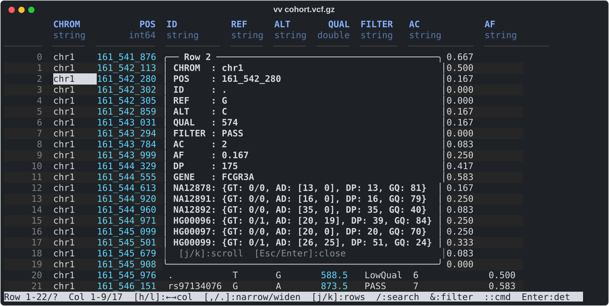

Per-variant genotype counts (`--gt-stats`) and a region query:

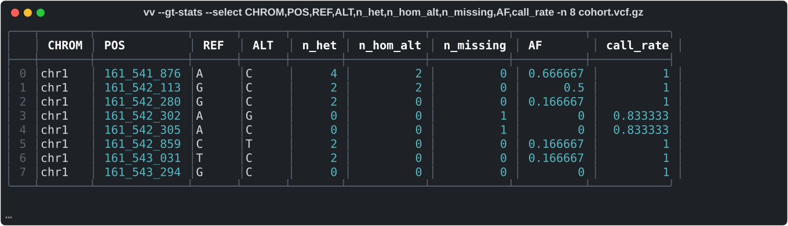
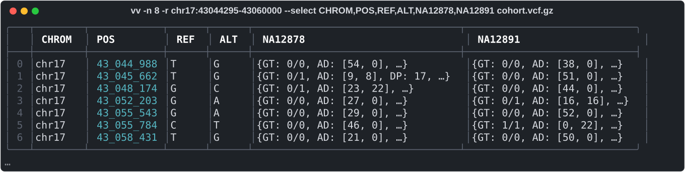

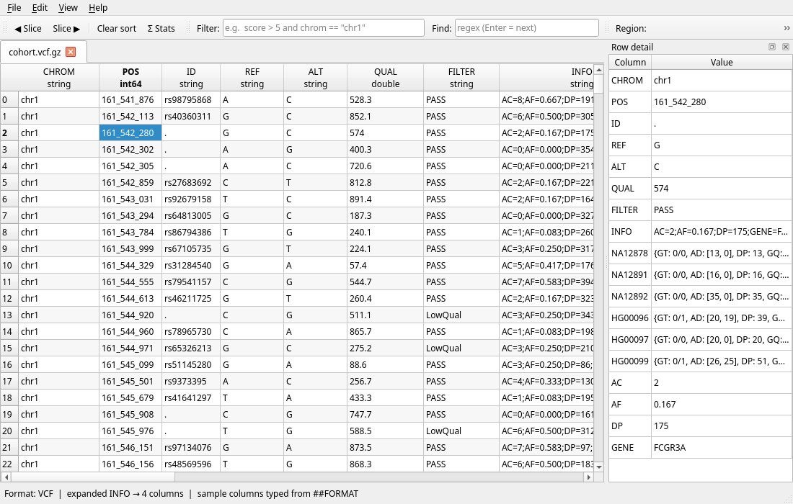

Try: `vv calls.vcf.gz` · `vv -r chr17:43044295-43125483 calls.vcf.gz` ·
`vv --samples long --filter 'GT == "1/1"' calls.vcf.gz`.
More: [range queries](USAGE.md#range-queries--r---regions-file---slop),
[`--samples`](USAGE.md#sample-columns---samples),
[`--gt-stats`](USAGE.md#--gt-stats-vcfbcf-genotype-aggregates).

## BAM / CRAM / SAM / PAF

`.bam` `.cram` `.sam` `.paf` — one row per alignment; FLAG filters by name
(`FLAG lacks UNMAP,DUP`), `--tags NM,AS` adds typed aux-tag columns,
`--pileup -f ref.fa` gives samtools-style pileup rows.

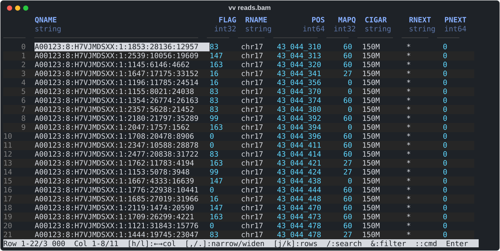

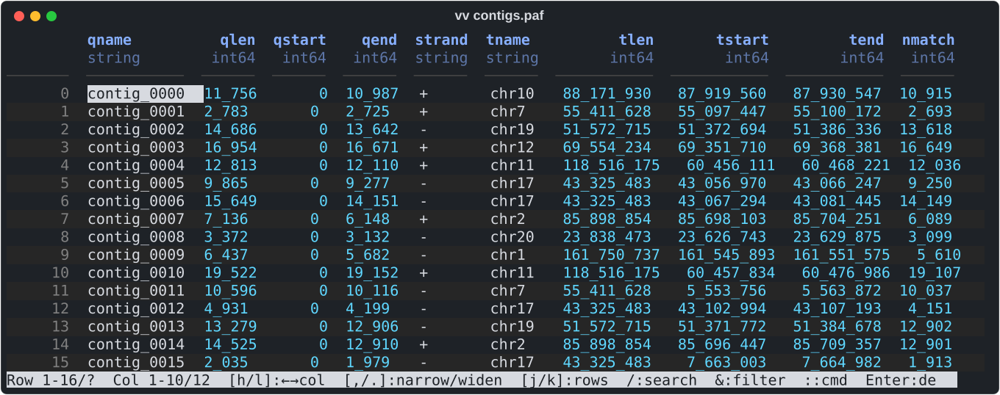

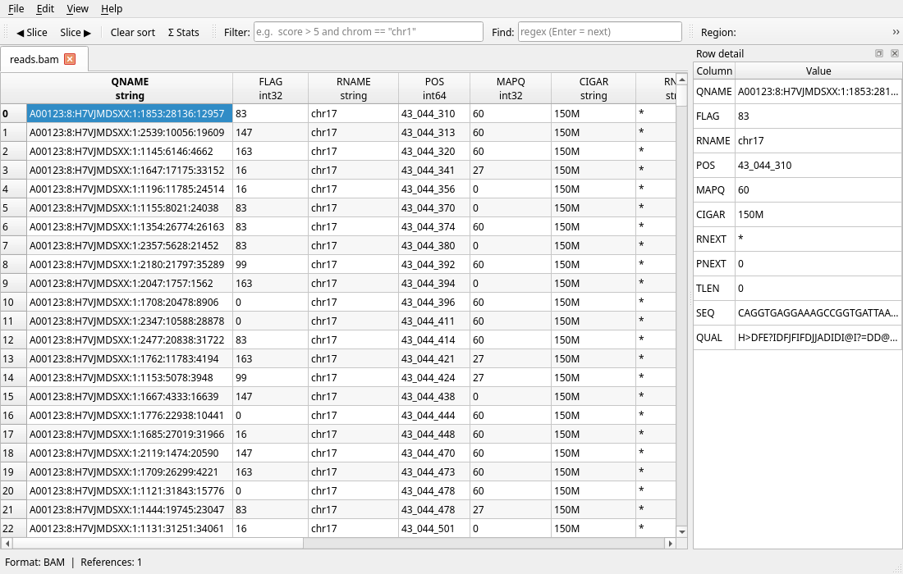

Try: `vv -r chr17:43044295-43050000 reads.bam` ·
`vv --filter 'MAPQ >= 30 and FLAG lacks DUP' --tags NM reads.bam` ·
`vv --contigs reads.bam`.
More: [`--tags`](USAGE.md#--tags-list-bam--cram--sam-aux-tags),
[`--contigs`](USAGE.md#--contigs-reference-sequences--assembly).

## BED and ENCODE peaks

`.bed` `.narrowPeak` `.broadPeak` `.gappedPeak` `.bedGraph` `.tagAlign`
(plain, `.gz`, `.zst`, `.bz2`, `.xz`) — named, typed columns (`signalValue`, `pValue`, …);
BED `itemRgb` is drawn as a colour swatch.

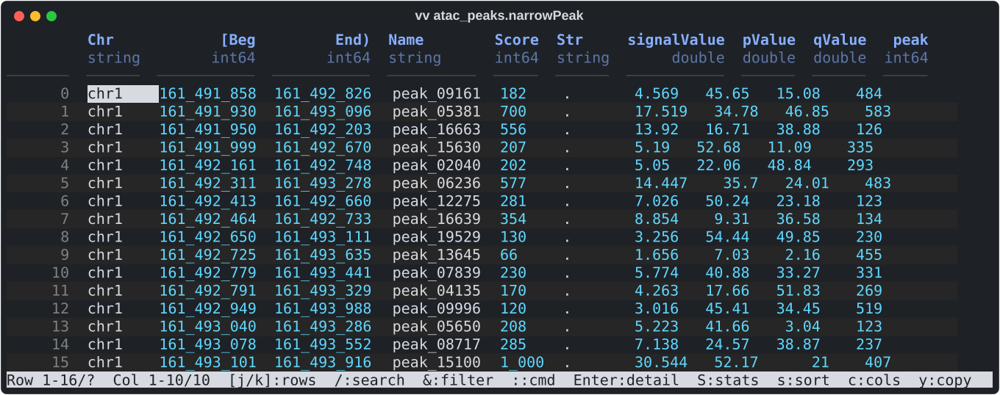

Try: `vv peaks.narrowPeak` · `vv --sort signalValue:desc -n 20 peaks.narrowPeak` ·
`vv -r chr1:1000000-2000000 peaks.bed.gz`.

## GFF / GTF

`.gff` `.gff3` `.gtf` (plain, `.gz`, `.zst`, `.bz2`, `.xz`) — the nine columns; `--expand
attributes` unpacks the attribute column into one column per key.

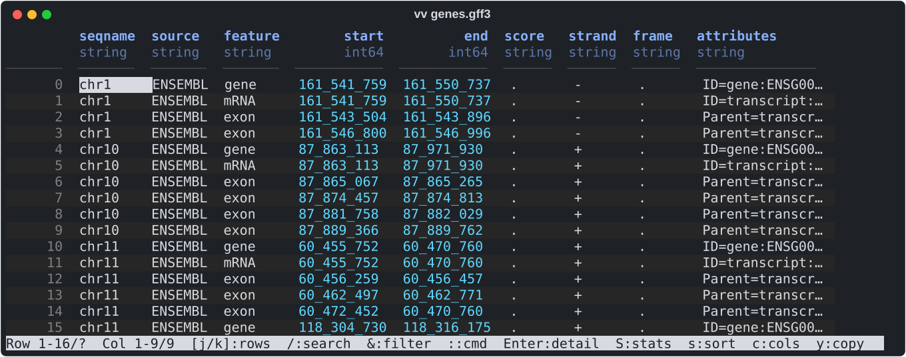

Try: `vv --expand attributes --filter 'feature == "gene"' --select seqname,start,end,Name genes.gff3`.

## FASTA / FASTQ

`.fa` `.fasta` `.fna` `.faa` `.fq` `.fastq` (plain or gzip / bgzf) — one row per
record; `--seq-stats` summarises a file (N50, GC, Q20).

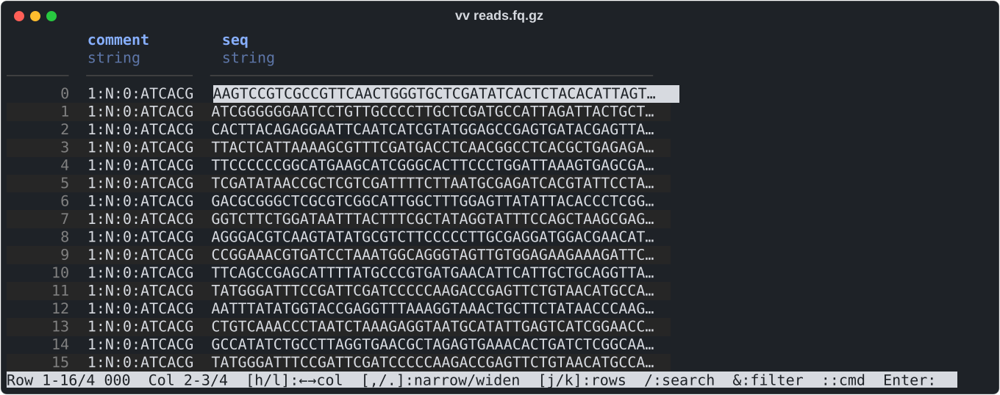
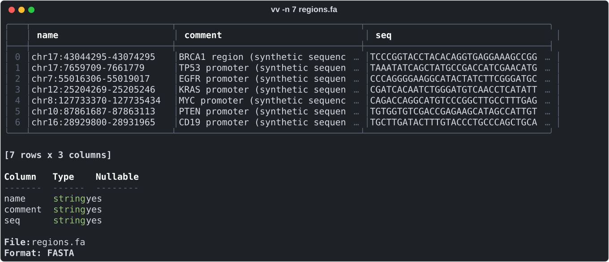
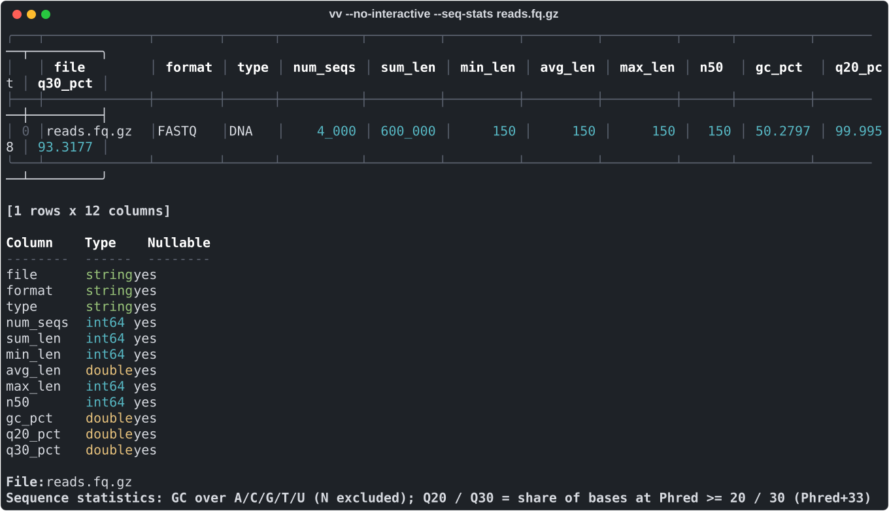

Try: `vv reads.fq.gz` · `vv --seq-stats reads.fq.gz` ·
`vv --filter 'name ~ "^chr17"' genome.fa`.
More: [`--seq-stats`](USAGE.md#--seq-stats-fasta--fastq-summary).

## bigWig / bigBed / 2bit / WIG

`.bw` `.bigWig` `.bb` `.bigBed` `.2bit` — bigWig intervals and values, bigBed
records typed from their embedded autoSql, 2bit sequence index; region queries
use the file's own index.

Text wiggle (`.wig`, also compressed): `fixedStep` / `variableStep` sections
are expanded into bedGraph rows — `Chr`, `[Beg`, `End)`, `value`, 0-based
half-open — so they filter, sort and export like a bedGraph.

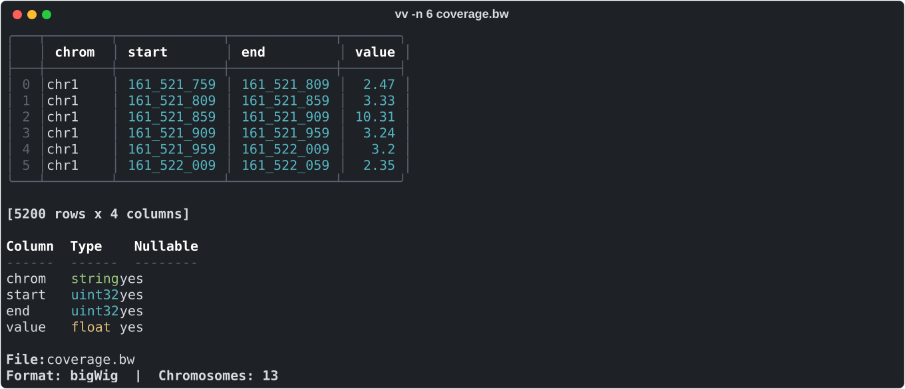

Try: `vv -r chr17:43044295-43125483 coverage.bw` · `vv genome.2bit`.
More: [bigBed / bigWig](USAGE.md#bigbed--bigwig-specifics).

## mpileup

`.pileup` `.mpileup` `.pile` (plain, `.gz`, `.zst`, `.bz2`, `.xz`) — per-base rows; a
multi-sample file gets `depth_i` / `bases_i` / `quals_i` per sample. `vv
x.bam --pileup -f ref.fa` produces the same rows from a BAM / CRAM.

Try: `vv sample.mpileup.gz -r chr1:1000-2000` · `vv reads.bam --pileup -f ref.fa -r chr17:43045000-43045100`.

## BLAST / DIAMOND tabular

`.m8` `.blast6` `.outfmt6` — `-outfmt 6` output (DIAMOND's default) has no
header row; the 12 standard columns are named (`qseqid sseqid pident length
mismatch gapopen qstart qend sstart send evalue bitscore`) and typed, with
`pident`, `evalue` and `bitscore` always real. A custom `-outfmt "6 ..."` file
keeps generic column names.

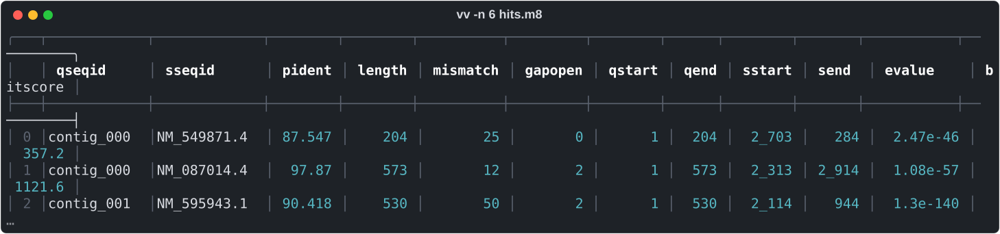

Try: `vv hits.m8` · `vv --filter 'evalue < 1e-10 and pident > 90' --sort bitscore:desc hits.m8` ·
`vv --unique qseqid hits.m8`.

## PLINK and TSV layouts

`.bim` `.fam` `.pvar` `.psam`, `.bedpe` `.pairs` `.gct` `.maf` — each read
with its own header convention (PLINK 2 column names, bedtools' BEDPE names,
GCT's dimension and metadata lines kept out of the data). A PLINK `.bed` /
`.pgen` genotype file is refused with the `plink2` command that converts it.

Try: `vv data.bim` · `vv expression.gct`.

## AnnData / HDF5 / Loom / 10x

`.h5ad` `.h5mu` `.h5` `.hdf5` `.loom` `.h5seurat` `.fast5` `.nc` `.nc4`, Cell Ranger `filtered_feature_bc_matrix.h5` and
`matrix.mtx` directories — a summary tab (shapes, storage, a per-matrix value
profile) and one tab per component: `X`, `obs`, `var`, `obsm`, `varm`,
`layers`, `obsp`, `uns`. Sparse matrices are previewed, not densified; `--tab X
--parquet` exports the whole matrix.

A MuData file (`.h5mu`) opens as a summary naming its modalities, the joint
`obs` / `var`, then each modality's AnnData tabs prefixed with its name
(`rna:X`, `prot:obs`); `--tab rna:obs` picks one. h5Seurat, Oxford Nanopore
FAST5 and NetCDF-4 files are HDF5 and open as its hierarchy and datasets
(NetCDF-3 classic is not HDF5 and is refused with the `nccopy` command that
converts it).

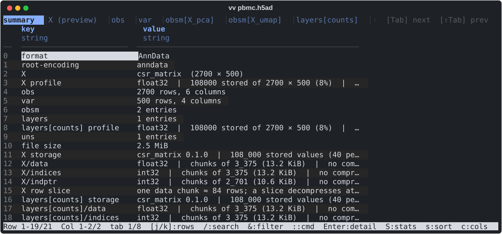
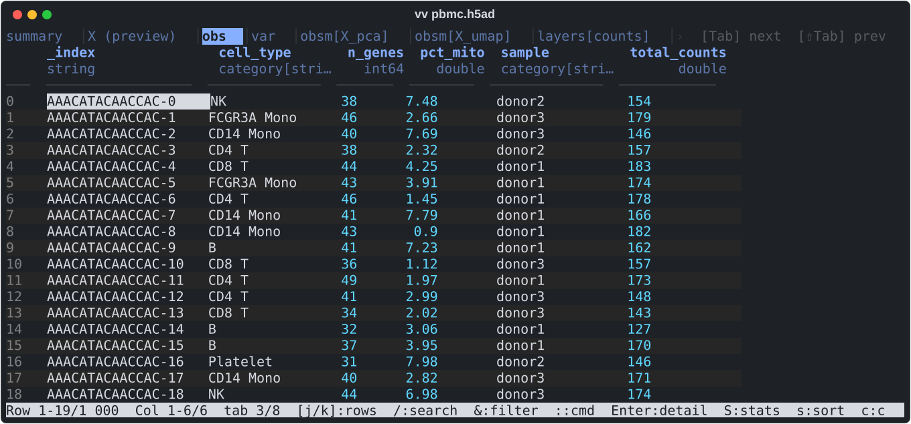

Try: `vv pbmc.h5ad` · `vv --tab obs --filter 'cell_type == "B"' pbmc.h5ad` ·
`vv --tab X --matrix long --tsv pbmc.h5ad > counts.tsv`.
More: [`--schema`](USAGE.md#--schema), [`--matrix`](USAGE.md#data-exploration).

## Zarr

`.zarr` directories (or any directory with Zarr metadata at its root) and
zipped stores (`.zarr.zip`, also on stdin). An AnnData or MuData store
written with `write_zarr` opens with the same tabs as its `.h5ad` / `.h5mu`
— summary, `X`, `obs`, `var`, `obsm`, `layers`, `obsp`, `raw`, `uns`,
modalities — and the summary's storage rows show the chunking and codecs.
Any other store (OME-Zarr images, xarray datasets) opens as a hierarchy tab
plus one tab per 1-D / 2-D array. Zarr v2 (compressors blosc, zstd, gzip,
zlib, lz4, bz2; C and Fortran order) and v3 (`zarr.json`; codecs transpose,
bytes, vlen-utf8, blosc, gzip, zstd, crc32c; `c/` or v2-style chunk keys;
sharded arrays, reading only the shard index and the inner chunks needed)
are read, with vlen-utf8 and fixed-width strings; missing chunks read as the
fill value.

Try: `vv pbmc.zarr` · `vv --tab obs --tsv pbmc.zarr.zip` ·
`vv --tab 'X (preview)' --parquet x.parquet pbmc.zarr`.

## MatrixMarket

`.mtx` `.mtx.gz` — coordinate entries as `row`, `col`, `value` (0-based), shape
and entry count in the footer. A 10x / STARsolo directory opens as labelled
`matrix` / `features` / `barcodes` tabs.

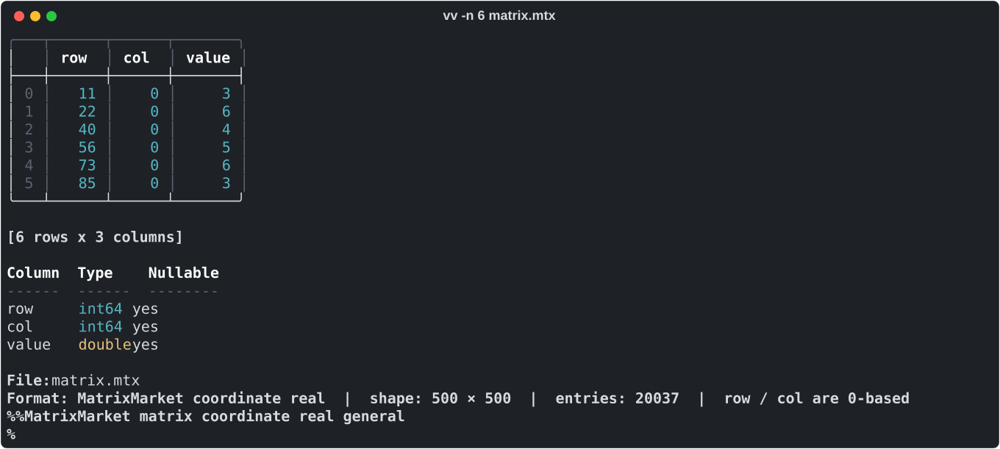

Try: `vv matrix.mtx.gz` · `vv filtered_feature_bc_matrix/`.

## NumPy

`.npz` `.npy` — a summary tab plus one tab per array; 1-D arrays are a column,
2-D a table, 3-D+ are 2-D slices stepped with `[` / `]`.

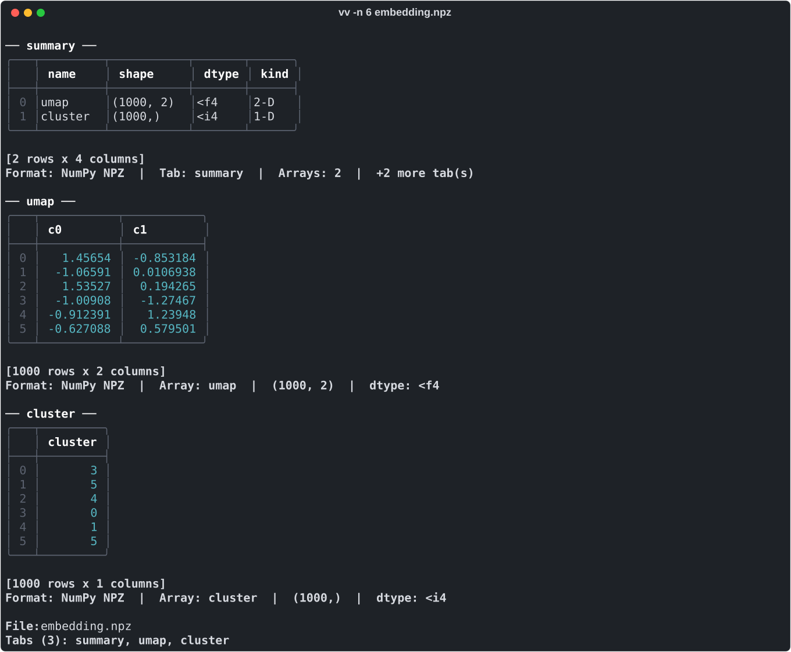

Try: `vv embedding.npz` · `vv --tab umap --tsv embedding.npz`.

## Nanopore POD5

`.pod5` — Oxford Nanopore's raw-signal container (Arrow tables inside one
file). Tabs: **reads** — one row per read: `read_id` (as UUID text),
read number, start sample, `num_samples`, channel, well, pore type,
calibration, end reason, run, scaling and level columns; **signal** — one
row per stored signal chunk (a long read spans several): `read_id`, the
samples decoded from VBZ (zstd + stream-VByte deltas) as a list of int16, and
their count; **run_info** — acquisition, flow cell, kit, protocol, sample rate
and the context / tracking tags. Record batches are read on demand.

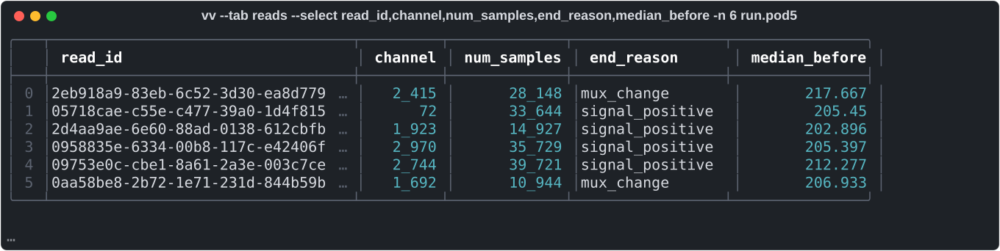

Try: `vv --select read_id,channel,num_samples,end_reason --sort num_samples:desc run.pod5` ·
`vv --tab run_info --vertical run.pod5`.

## GenBank / EMBL

`.gb` `.gbk` `.gbff` `.genbank` `.embl` (plain or compressed) — NCBI / ENA
flat files with one or more records. Tabs: **features** — one row per feature:
`record` (accession.version), `type`, `start` / `end` (0-based half-open, the
span of all parts), `strand`, `location` as written in the file
(`complement(join(61..90,11..40))`), then one column per qualifier in order of
first use (`gene`, `locus_tag`, `product`, `translation`, …; a repeated
qualifier such as `db_xref` is joined with `; `, a flag such as `/pseudo` is an
empty string); **records** — locus, length, molecule, topology, division,
date, definition, organism, taxonomy, keywords, feature count; **sequences**.
The file is read into memory (an 11 MB E. coli EMBL record opens in 0.06 s).

`-r` keeps the features overlapping a window, the record named by its
accession.version, accession or locus name.

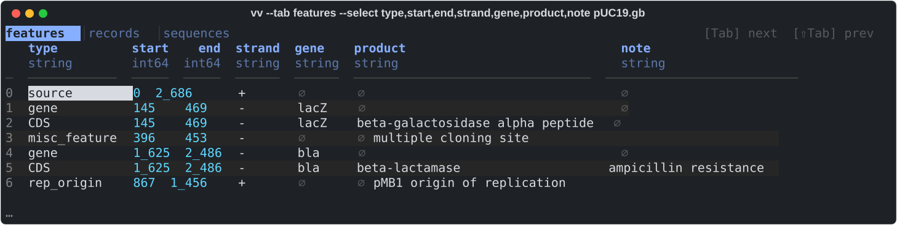

Try: `vv --filter 'type == "CDS"' --select locus_tag,product,start,end NC_000913.gbff` ·
`vv -r NC_001416.1:0-5000 lambda.gb`.

## Cooler Hi-C

`.cool` `.mcool` — Hi-C contact matrices in the Cooler HDF5 layout (also an
`.h5` whose root says `format = HDF5::Cooler`). Tabs: **summary** (resolutions,
assembly, bins / pixels / sum per resolution, metadata), **chroms**, then per
resolution **pixels** — one row per stored entry of the upper triangle, joined
to bin coordinates as `cooler dump --join` prints them, with a `balanced`
column (count × weight₁ × weight₂) when the bins carry a `weight` — and
**bins** (chrom, start, end, `weight` and any other balancing vectors). An
`.mcool` names them per resolution: `pixels@10kb`, `bins@10kb`. Pixels and bins
are read in chunks, so a multi-gigabyte file opens at once.

`-r` selects the region × region submatrix (bin1 and bin2 both in the region)
through the file's bin index, and the bins in the region.

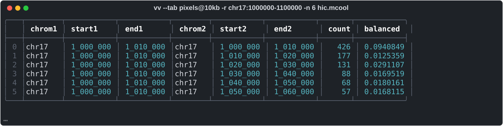

Try: `vv --tab pixels@10kb -r chr2:1000000-2000000 sample.mcool` ·
`vv --tab pixels --filter 'chrom1 == "chr1" AND count >= 10' --tsv sample.cool`.

## R data

`.rds` `.RData` `.rda` — data frames, atomic vectors and dense matrices, one
tab per object in an `.RData` file. Factors become categorical columns, `Date`
/ `POSIXct` date and timestamp columns, `NA` null; character row names and
matrix row names become an `index` column. Compressed files (gzip, bzip2, xz)
are read. Lists and S4 objects (Seurat, SingleCellExperiment, sparse
`Matrix`) are not: export the part you need (`saveRDS(as.data.frame(x))`,
`write.csv`) or convert a Seurat object to AnnData.

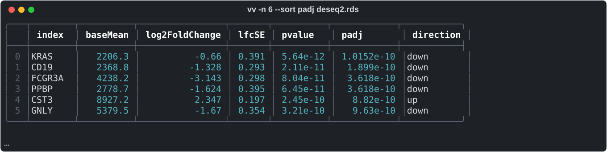

Try: `vv results.rds` · `vv --tab counts --tsv session.RData` ·
`vv --filter 'padj < 0.05' --sort log2FoldChange:desc deseq2.rds`.

## Parquet / Arrow / ORC

`.parquet` `.lociss` `.arrow` `.feather` `.arrows` `.orc` — the first screen
decodes only the row groups it needs; nested, temporal, decimal and dictionary
columns are shown as values. `S` opens column statistics; `--schema` and
`--describe` print them.

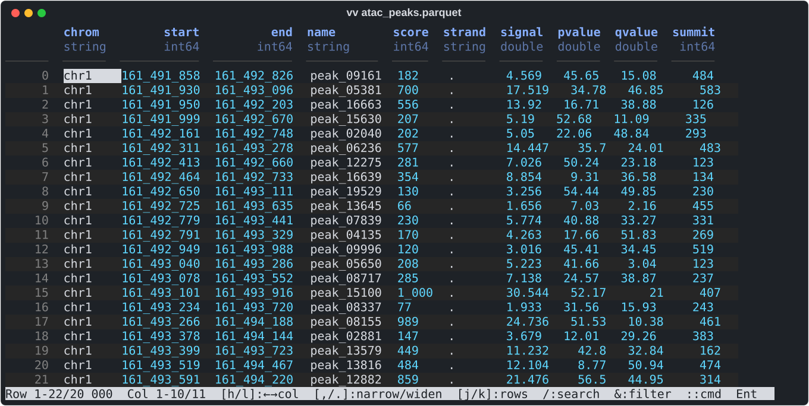
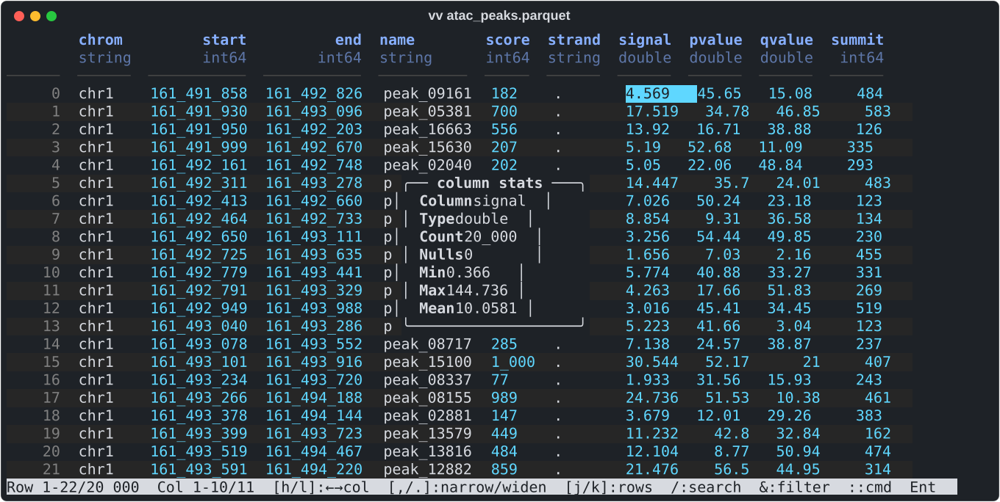
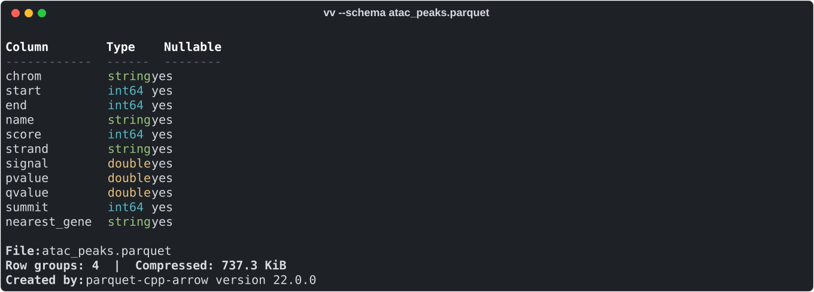
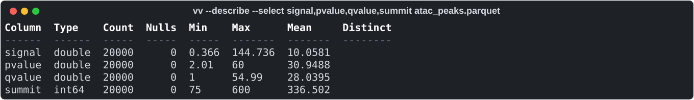

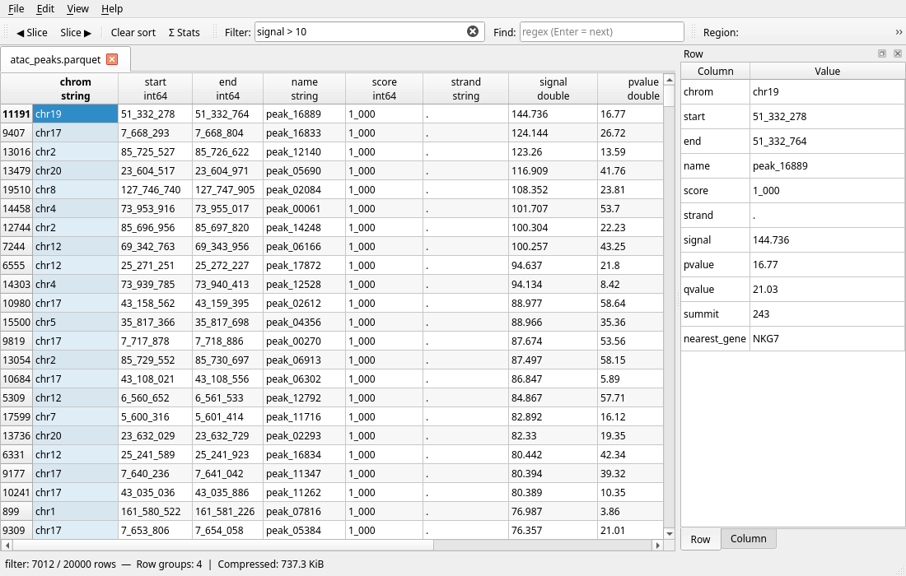

Try: `vv peaks.parquet` · `vv --filter 'signal > 10' --sort signal:desc peaks.parquet` ·
`vv -r chr1:1000000-2000000 peaks.parquet`.
More: [`--describe`](USAGE.md#--describe), [`--stats`](USAGE.md#--stats-parquet-only),
[LociSSD](USAGE.md#locissd-specifics).

## TSV / CSV

`.tsv` `.csv` (plain, `.gz`, `.zst`, `.bz2`, `.xz`; other extensions by content) — types are
inferred; `##` preambles, R-style row names and quoted `NA` are handled.

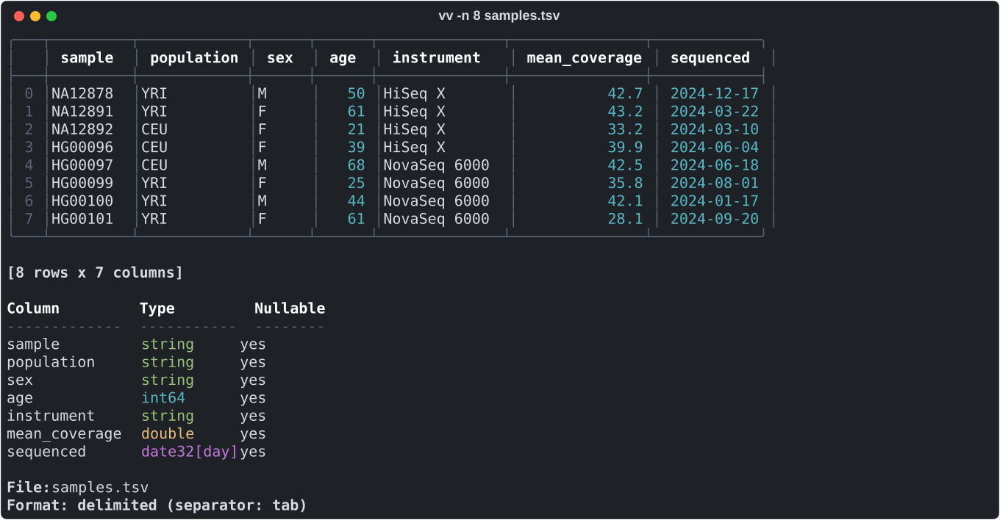

Try: `vv samples.tsv` · `vv --filter 'age > 40' --select sample,age samples.tsv` ·
`vv -d ';' export.txt`.

## Excel / ODS / SQLite

`.xlsx` `.xlsm` `.ods` `.fods` `.sqlite` `.sqlite3` `.db` — one tab per sheet or
table; `--tab NAME` picks one from the command line.

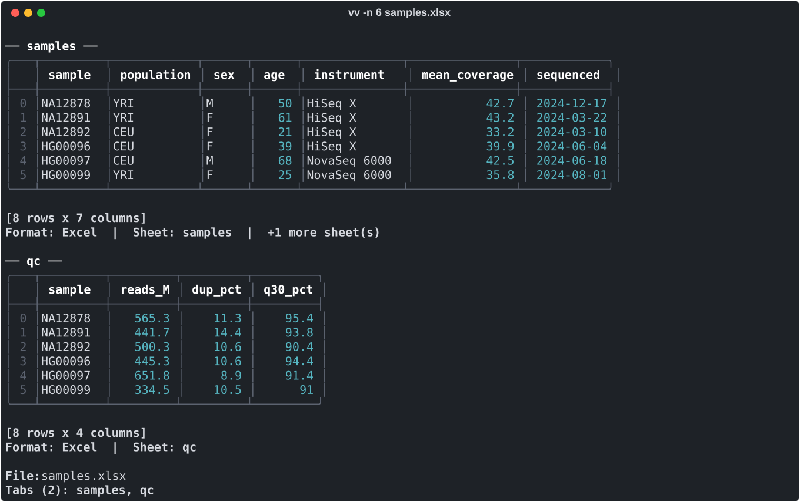
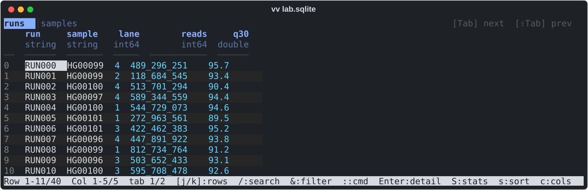

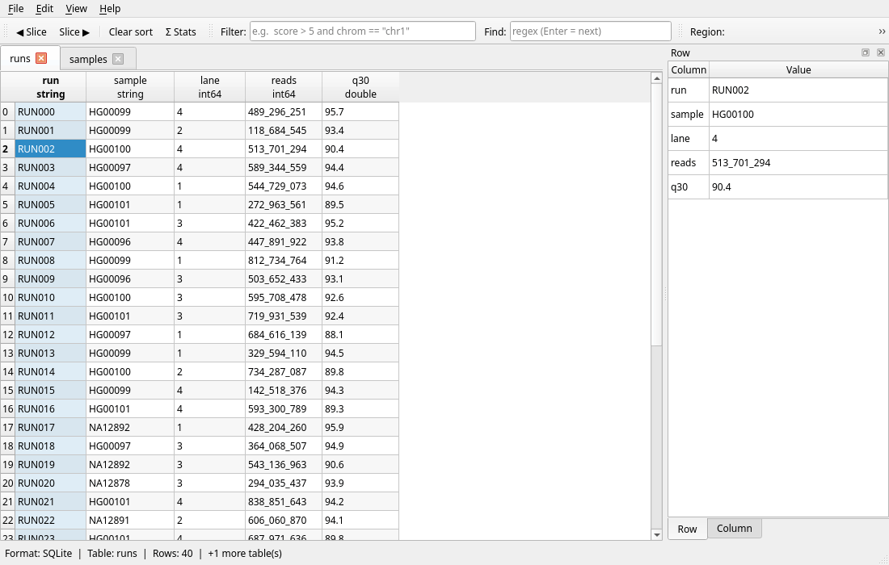

Try: `vv lab.sqlite` · `vv --tab qc --tsv samples.xlsx`.

## Directories and datasets

`vv DIR/` — the Parquet / Arrow / ORC / CSV / TSV / JSON files under a directory
as one table; Hive `key=value/` path components become columns.

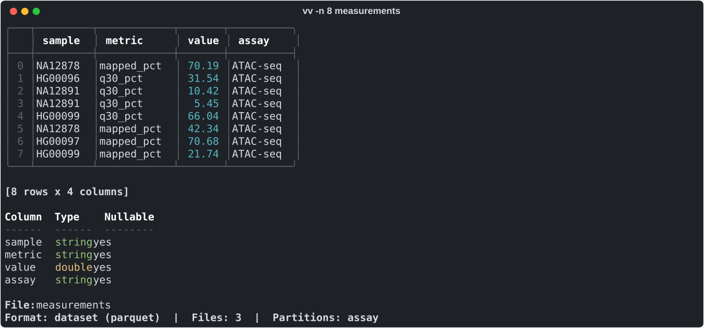

Try: `vv measurements/` · `vv --filter 'assay == "WGS"' measurements/`.
More: [directories](USAGE.md#directories-and-partitioned-datasets).

## JSON / NDJSON

`.json` `.ndjson` `.jsonl` `.geojson` `.ipynb` `.har` (plain, `.gz`, `.zst`, `.bz2`, `.xz`, or on stdin) — on a terminal
a document opens in a folding tree (jq paths, search, copy, `t` for a table of
records); in a pipe it is re-indented, or listed as `path = value` lines with
`--json-paths`. NDJSON / record arrays are tables with any table flag.

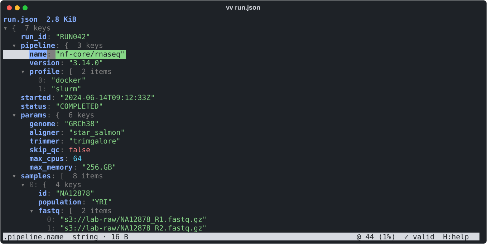
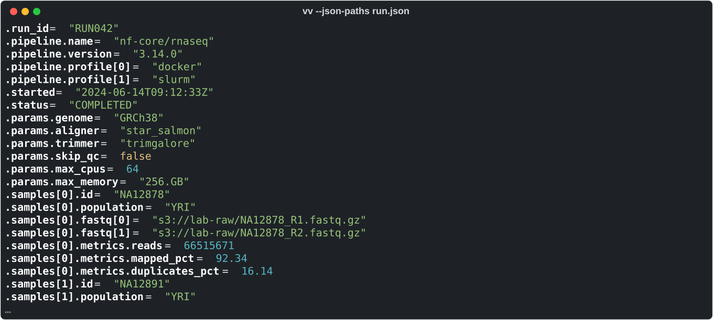
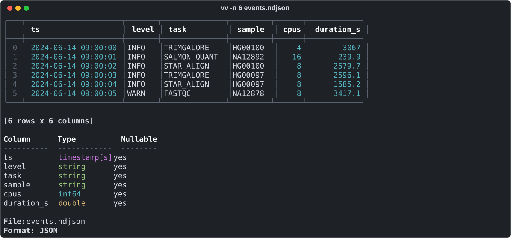

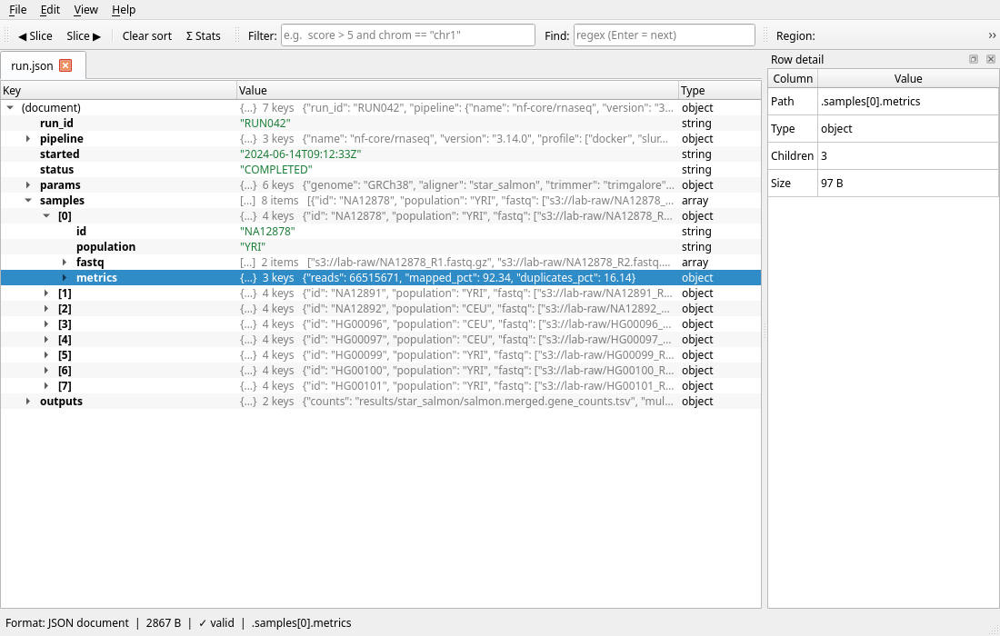
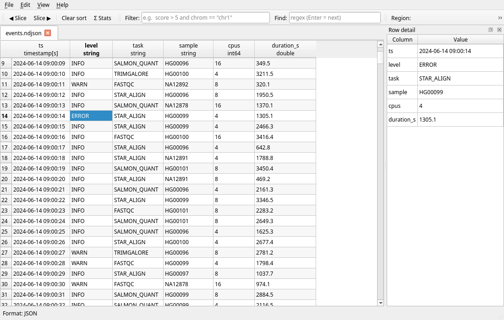

Try: `vv run.json` · `curl -s https://api.github.com/repos/balwierz/vv | vv -` ·
`vv --json-paths run.json | grep metrics`.
More: [JSON documents](USAGE.md#json-documents).

## Markdown

`.md` `.markdown` — rendered with colour; GFM tables go through vv's table
renderer; local images are shown inline on kitty / iTerm2 / WezTerm.

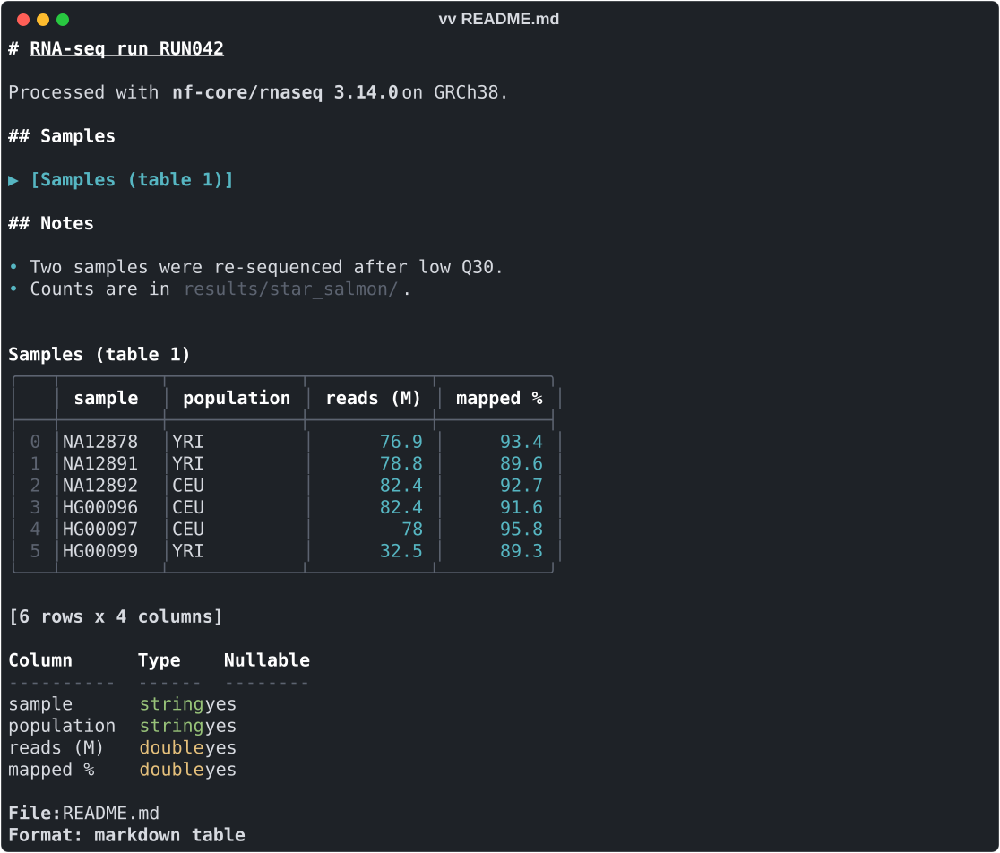

## Plain text and logs

`.txt` `.log` (plain, `.gz`, `.zst`, `.bz2`, `.xz`) and any other file that sniffs as text —
a `less -SN`-like view with line numbers, sideways scrolling, `/` search and `&`
filter; ANSI colours in the file are kept. Binary files are refused, not dumped.

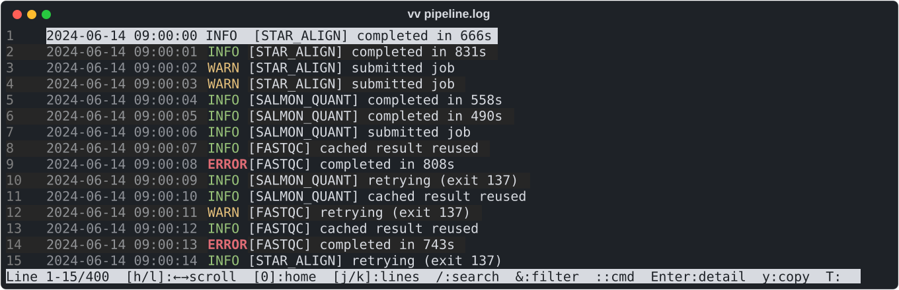

Try: `vv pipeline.log` · `vv --filter 'line contains "ERROR"' pipeline.log`.
More: [plain text](USAGE.md#plain-text-txt-log-and-the-sniffed-fallback).

## Stdin

`vv -` reads from a pipe: text formats stream as they arrive (gzip / zstd
decoded); binary formats are copied to a temporary file first. Process
substitution works the same way.

Try: `zcat calls.vcf.gz | vv -` · `vv <(curl -s https://example.org/data.parquet)`.
More: [stdin](USAGE.md#stdin).
