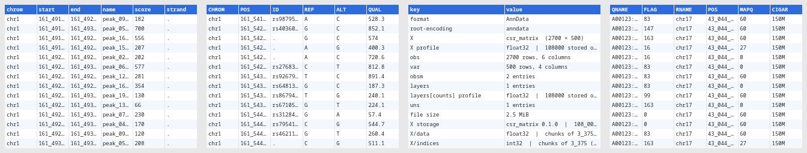

# vvg — the desktop viewer

`vvg` is a Qt6 window over the same reader as `vv`: it opens every format vv
does ([gallery](formats.md)), one tab per file, sheet, table or component.


## Start

```sh
vvg data.parquet                    # or any supported file; several → one tab each
vvg --tab obs cells.h5ad            # vv's view flags open the same view
vvg --filter 'signal > 10' --sort signal:desc peaks.parquet
vvg -r chr17:43044295-43125483 calls.vcf.gz
```

vvg takes vv's view flags — `--filter`, `--select`, `--sort`, `--tab`,
`-r` / `--region` (with `--coords`, `--slop`), `--tags`, `--pileup`,
`--gt-stats`, `--contigs` — and *Edit ▸ Copy as vv Command* goes the other way.


## What it does

- **Tabs** — files, workbook sheets, SQLite tables, HDF5 / AnnData components
  and NumPy arrays each get a tab. Open with *File ▸ Open*, drag-and-drop or the
  recent-files list.
- **Sort, filter, find** — click a header to sort (by type, not text); the
  filter bar uses vv's `--filter` grammar (`score > 5 and chrom == "chr1"`);
  the find bar takes a regex. All three run off the UI thread with a progress
  bar and *Cancel*, so multi-GB files stay responsive.
- **Region bar** — `chr1:1000-2000` (UCSC or NCBI coordinates, optional slop)
  re-opens indexed files over that range; *Pileup* shows BAM / CRAM as mpileup
  rows.
- **Expand** (on by default) — VCF `INFO` and GFF / GTF `attributes` are split
  into one column per key, sortable and filterable.
- **Row detail, stats, columns** — a dock with the current row, *Σ Stats* per
  column, show / hide columns, go to row, ◀ / ▶ slices for 3-D arrays,
  *Ctrl+C* copies the selection as TSV. *View ▸ Smooth Scrolling* (on by
  default) scrolls by pixels; off, by whole rows and columns.
- **Copy as vv command** (*Ctrl+Alt+C*) — the `vv` command line that reproduces
  the tab: file, `--tab`, region options, `--filter`, `--sort`, `--select`.
- **Export view** (*Ctrl+E*) — the tab's rows after filter / sort / column
  choice, to Parquet, Arrow, TSV, CSV, JSON or NDJSON, written by vv's own
  writers (every row, not only the visible ones), in the background with
  *Cancel*.


## KDE Plasma

The `vv-gui` package also integrates with Dolphin:

- double-click / *Open With* opens files in vvg;
- **thumbnails** — a snapshot of the first rows in the icon view;
- **Information Panel** — row and column counts, schema, codec, writer; for
  BAM / SAM / VCF / BCF the reference count, assembly, sort order, read groups
  and samples;
- MIME types for the genomic formats, so `.vcf` is not taken for a vCard nor
  `.bam` for an archive.



CRAM and FASTA get no thumbnail or panel entry: a CRAM may fetch its reference
over the network, and a FASTA's first record can be a whole chromosome.

## Install

Packages: `vv-gui` for Debian / Ubuntu, Fedora and Arch —
[INSTALL.md](../INSTALL.md#prebuilt-binaries). From source:
`cmake -DVV_BUILD_GUI=ON` ([details](../INSTALL.md#optional-qt6-gui--dvv_build_guion));
vvg needs Qt6, and the KF6 `kio`, `kcoreaddons` and `kfilemetadata` modules add
the Dolphin plugins when present.
