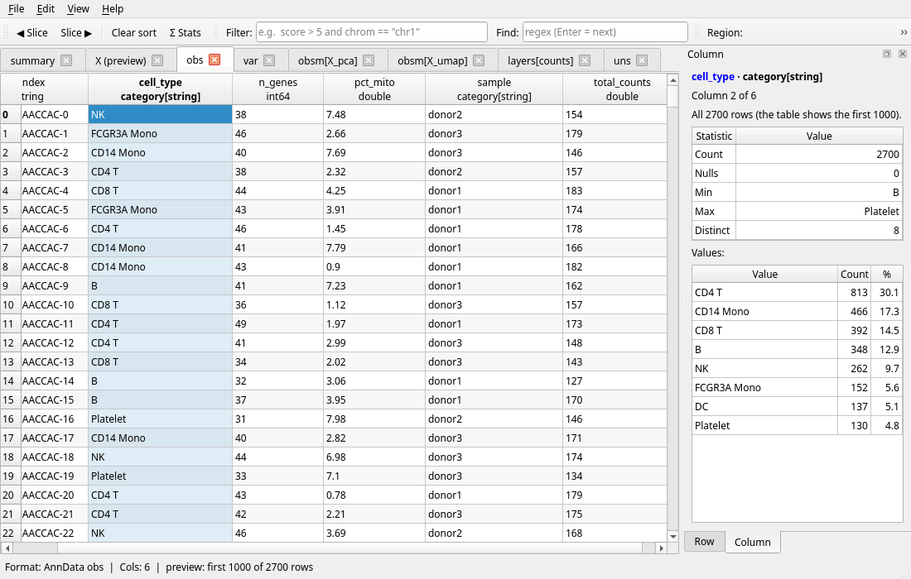

# vvg — the desktop viewer

`vvg` is a Qt6 window over the same reader as `vv`: it opens every format vv
does ([gallery](formats.md)), one tab per file, sheet, table or component.


## Start

```sh
vvg data.parquet                    # or any supported file; several → one tab each
vvg --tab obs cells.h5ad            # vv's view flags open the same view
vvg --filter 'signal > 10' --sort signal:desc peaks.parquet
vvg -r chr17:43044295-43125483 calls.vcf.gz
```

vvg takes vv's view flags — `--filter`, `--select`, `--sort`, `--tab`,
`-r` / `--region` (with `--coords`, `--slop`), `--tags`, `--pileup`,
`--gt-stats`, `--contigs`, `--samples`, `--matrix` — and *Edit ▸ Copy as vv
Command* goes the other way.


## What it does

- **Tabs** — files, workbook sheets, SQLite and DuckDB tables, HDF5 / Zarr /
  AnnData components, Cooler resolutions, GenBank sections, POD5 tables, R
  objects and NumPy arrays each get a tab. Open with *File ▸ Open*, drag-and-drop or the
  recent-files list.
- **Sort, filter, find** — click a header to sort (by type, not text) and
  put the cursor in that column; the
  filter bar uses vv's `--filter` grammar (`score > 5 and chrom == "chr1"`);
  the find bar takes a regex. All three run off the UI thread with a progress
  bar and *Cancel*, so multi-GB files stay responsive.
- **Region bar** — `chr1:1000-2000` (UCSC or NCBI coordinates, optional slop)
  re-opens indexed files over that range; *Pileup* shows BAM / CRAM as mpileup
  rows.
- **JSON tree** — a JSON document (`.json`, `.geojson`, `.ipynb`, `.har`, also
  compressed) opens as a tree: keys, values and types, children loaded as you
  expand, the jq path and validation in the status bar, the value in the detail
  dock. The Find bar searches keys and values (regex or plain text,
  case-insensitive), highlights matching rows and opens the tree to the next
  hit (F3 / Enter again for the next). Right-click → *Open … as Table* shows the array of objects at or above
  the row as a table tab; *Copy Value* / *Copy Path*. JSON Lines, or vv's table
  flags (`--filter`, `--select`, …), open as a table directly.
- **Expand** (on by default) — VCF `INFO` and GFF / GTF `attributes` are split
  into one column per key, sortable and filterable.
- **samples / matrix** — the toolbar's layouts for VCF / BCF sample columns
  (struct, long: one row per record × sample, text) and HDF5 / AnnData matrix
  tabs (wide, long: one row per stored value), as vv's `--samples` /
  `--matrix`.
- **Row and Column** — the right dock's *Row* tab lists every field of the
  current row; its *Column* tab summarises the cursor's column (below).
  *View ▸ Columns* shows / hides columns; go to row, ◀ / ▶ slices for 3-D
  arrays; *Ctrl+C* copies the selection as TSV. *View ▸ Smooth Scrolling* (on by
  default) scrolls by pixels; off, by whole rows and columns.
- **Selection summary** — select two or more cells and the status bar shows
  `Σ 13200.3 · mean 1100.025 · min 0 · max 3200 · 12 numbers` over the
  numeric cells among them (text, dates and hidden columns are skipped; up to
  1,000,000 cells). The numbers are plain, without digit grouping, and the
  text can be selected and copied.
- **Column tab** (*Σ Stats* raises it) — the cursor column, tinted in the
  table, by name and position (*Column 7 of 120*); click the name, or
  *→ show in table* when the column is scrolled out of view, to bring it
  back into view. Its count, nulls,
  sum, mean, standard deviation, min, 25% / median / 75%, max and distinct
  count, and its values with their counts and shares (the 50 most frequent;
  up to 10,000 distinct values are counted). Over the rows the filter keeps,
  and over the whole tab even where the table shows a preview: an AnnData
  `obs` of 300,000 cells is summarised in full, a matrix tab is labelled as
  the preview it is. It is computed in the background on a second copy of
  the tab, so the table stays usable while a large file is read (*Cancel*
  stops it); one pass covers every column, so moving the cursor afterwards
  is instant. A tab read from a pipe is summarised on request (*Compute*).
  The values are plain numbers in ordinary cells: *Ctrl+C* copies the
  selected ones as TSV; right-click for *Copy All as TSV* and *Copy as vv
  Command* (`vv … --describe --select col`). Double-click a value to filter
  the table to it.
- **Copy as vv command** (*Ctrl+Alt+C*) — the `vv` command line that reproduces
  the tab: file, `--tab`, region options, `--filter`, `--sort`, `--select`.
- **Export view** (*Ctrl+E*) — the tab's rows after filter / sort / column
  choice, to Parquet, Arrow, TSV, CSV, JSON or NDJSON, written by vv's own
  writers (every row, not only the visible ones), in the background with
  *Cancel*.




## KDE Plasma

The `vv-gui` package also integrates with Dolphin:

- double-click / *Open With* opens files in vvg;
- **thumbnails** — a snapshot of the first rows in the icon view;
- **Information Panel** — row and column counts, schema, codec, writer; for
  BAM / SAM / VCF / BCF the reference count, assembly, sort order, read groups
  and samples;
- MIME types for the genomic formats, so `.vcf` is not taken for a vCard,
  `.bam` for an archive nor `.gb` for a Game Boy ROM; also Cooler, Zarr zip,
  wiggle, BLAST tabular, GenBank / EMBL, POD5, DuckDB and R data.


CRAM and FASTA get no thumbnail or panel entry: a CRAM may fetch its reference
over the network, and a FASTA's first record can be a whole chromosome. Nor do
DuckDB files (opening one takes a lock that would block a writer while it is
indexed) or compressed GenBank / EMBL. Formats read whole at open get a
thumbnail only up to a size limit: xlsx 16 MB, ods 8 MB, npz 256 MB, R data
32 MB, GenBank / EMBL 96 MB.

## Install

Packages: `vv-gui` for Debian / Ubuntu, Fedora and Arch, the macOS tarball,
and the Windows installer (`vv-<ver>-windows-x86_64.msi`, which puts *vv
Viewer* in the Start menu) —
[INSTALL.md](../INSTALL.md#prebuilt-binaries). From source:
`cmake -DVV_BUILD_GUI=ON` ([details](../INSTALL.md#optional-qt6-gui--dvv_build_guion));
vvg needs Qt6, and the KF6 `kio`, `kcoreaddons` and `kfilemetadata` modules add
the Dolphin plugins when present.
